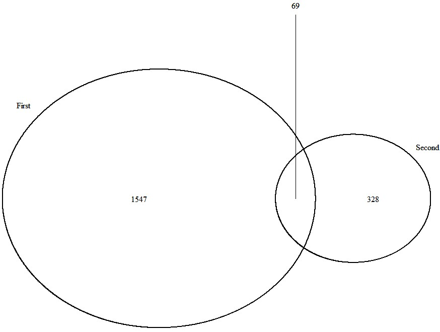

# [Franco](https://github.com/altsplicer) / [***Venn Diagram***](https://altsplicer.github.io/Venn_Diagram_script/VD_script.html)

##Overview

This a script walk-through of the venndiagram options used in Met Cancer project for the Hertel and Kaiser lab.
Documentation for ggvenn can be seen at https://github.com/yanlinlin82/ggvenn.
A general tutorial for VennDiagram can be found in https://www.geeksforgeeks.org/how-to-create-a-venn-diagram-in-r/.

## Installation
```{r}
#Install & load ggvenn
#install.packages("ggvenn")
#Install & load ggplot2 package
#install.packages("ggplot2")
#Install & load VennDiagram package
#install.packages("VennDiagram")
```

## Load required packages
```{r}
library(VennDiagram)
library("ggplot2")
library("ggvenn")
```


## Loading the data into the R environment
```{r}
#ggvenn supports two types of input data: a list and data frame. 
KaiservsPRMTinhibitor_MB468 <- read.delim("G:/Documents/Kaiser_Collab/KaiservsPRMTinhibitor_MB468.txt")
#head of the data frame.
head(KaiservsPRMTinhibitor_MB468, 5)
```
[](#nolink)

## Venn diagram using ggvenn
Venn diagram using a list dataframe.
ggVenn goes through the list and calculates and displays the numbers of the venn diagram.
This code results in a customizable venn diagram from your data.

```{r}
#ggvenn(data, c("column_name1", "column_name2"), show_percentage = FALSE, text_size = 6, set_name_size = 6, fill_color = c("color1", "color"))
#data = dataframe, column_name = the dataframe column names, show_percentage = show percentage of each set, text_size = text size for intersect contents, fill_color = cirlce colors.
ggvenn(KaiservsPRMTinhibitor_MB468, c("MB468_0_v_720mins", "PRMT_inhibitor_v_GSC"), show_percentage = FALSE, text_size = 6, set_name_size = 6, fill_color = c("dodgerblue2", "brown3"))

```
[](#nolink)

clears the previous rendered image venn diagram
```{r}
grid.newpage();
```

## Venn diagram using VennDiagram package

While ggVenn is very useful in making and calculating the numbers of a venn diagram from a dataset, it is limited in that the venn diagram it produces aren't scaled.
VennDiagram does produce scaled venn diagram. One could take the numbers from ggvenn and make a scaled Venn diagram using VennDiagram.
```{r}
#area1 = size of first set, area2 = size of the second set, n12 = size of intersection between the first and second set, First and second are the given titles of the first and second set.
#draw.pairwise.venn(area1,area2, n12, c("First", "Second"))
venn.plot <- draw.pairwise.venn(1616, 397, 69, c("First", "Second"))
```
[](#nolink)

Note that you can then take the scaled venn diagram image produced via ggVenn and use it as a scaled template and make new figures in adobe or power point. 